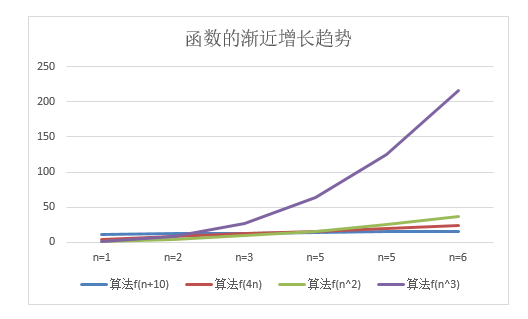

# 数据结构和算法
关于数据结构和算法的学习和理解

* [基本概念](#一-基本概念)
  * [浅谈数据结构](#1-1-浅谈数据结构)
  * [浅谈算法](#1-2-浅谈算法)
  * [算法复杂度](#1-3-算法复杂度)
  * [时间复杂度](#1-4-时间复杂度)
  * [空间复杂度](#1-5-空间复杂度)
* [线性表](#二-线性表)
   * [栈](#栈)
   * [队列](#队列)
* [树](#树)
  * [浅谈树](#浅谈树)
  * [二叉树](#二叉树)
  * [线索二叉树](#线索二叉树)
  * [赫夫曼树](#赫夫曼树)
* [图](#图)
  * [浅谈图](#浅谈-图)
  * [邻接表](#邻接表)
  * [十字链表](#十字链表)
  * [邻接多重表](#邻接多重表)
  * [边集数组](#边集数组)
  * [图的遍历-深度优先遍历](#图的遍历-深度优先遍历)
  * [算法-马踏棋盘算法](#算法-马踏棋盘算法)
  * [图的遍历-广度优先遍历](#图的遍历-广度优先遍历)


*  一些约定的描述：  

类型 | 描述 | 举例
---|---|---
阶 | 在时间复杂度中：阶等同于时间 | 常数阶等同于常数时间
n | 表示一个变量、问题规模、输入规模|

* 数学符号：  

类型 | 描述 | 举例
---|---|---
^ | 等同于次方 | 如：2^3=2*2*2=8，n^2即n的平方，c^n即c的n次幂
c | 一般表示为一个常数|1，2，3，4
N* | 正整数集，等同于N+ |  不包括0的正整数集，如1，2，3
N | 自然数集(非负整数集) |  包含正整数和零，如0，1，2
Z | 整数集 | 包括正整数、零、负整数，如-1，0，1
Q | 有理数集 | 包括整数和分数(两个整数的比)
R* | 正实数集 | 不包括0的正有理数和正无理数的集合
R | 实数集 | 包括有理数和无理数(无限不循环小数，如π，e)
∈ |  表示属于，包含关系 | N+ ∈ N ∈ Z ∈ Q ∈ R+ ∈ R

# 一 基本概念   
[:arrow_double_up:-Top](#数据结构和算法) &nbsp; &nbsp; &nbsp; [:arrow_double_down:-二-线性表](#二-线性表)

### 1-1 浅谈数据结构
[:arrow_up:-一-基本概念](#一-基本概念) &nbsp; &nbsp; &nbsp; [:arrow_down:-1-2 浅谈算法](#1-2-浅谈算法)  
**1.1.1、什么是数据结构：**
> [数据结构(data structure)](https://baike.baidu.com/item/%E6%95%B0%E6%8D%AE%E7%BB%93%E6%9E%84/1450)是一门研究**非数值计算**的程序设计问题中的操作对象，以及他们之间的关系和操作等相关问题的学科

**1.1.2、理解数据结构：**
```
  数据结构是计算机存储、组织数据的方式。
  
  数据结构描述的是关系，指的是数据元素相互之间存在一种或多种特定关系的集合。
  
  通常情况下，精心选择的数据结构可以带来更高的运行或者存储效率。
  
  数据结构往往同高效的检索算法和索引技术有关。
  
  程序设计 = 数据结构 + 算法
```
**1.1.3、数据结构的定义：**
```
  数据结构是带有结构特性的数据元素的集合，
  它研究的是数据的逻辑结构和数据的物理结构以及它们之间的相互关系，并对这种结构定义相适应的运算，
设计出相应的算法，并确保经过这些运算以后所得到的新结构仍保持原来的结构类型。

  简而言之，数据结构是相互之间存在一种或多种特定关系的数据元素的集合，即带“结构”的数据元素的集合。
  “结构”就是指数据元素之间存在的关系，分为逻辑结构和存储结构。
```
```
  数据的逻辑结构和物理结构是数据结构的两个密切相关的方面，同一逻辑结构可以对应不同的存储结构。
  算法的设计取决于数据的逻辑结构，而算法的实现依赖于指定的存储结构。
```
```
  数据结构的研究内容是构造复杂软件系统的基础，它的核心技术是分解与抽象。
  通过分解可以划分出数据的3个层次；
  再通过抽象，舍弃数据元素的具体内容，就得到逻辑结构。
  类似地，通过分解将处理要求划分成各种功能，再通过抽象舍弃实现细节，就得到运算的定义。
 
  上述两个方面的结合可以将问题变换为数据结构，这是一个从具体(即具体问题)到抽象(即数据结构)的过程。

  然后，通过增加对实现细节的考虑进一步得到存储结构和实现运算，从而完成设计任务。
这是一个从抽象(即数据结构)到具体(即具体实现)的过程。
```
**1.1.4、数据结构研究的对象：**  
1.1.4.1、数据的逻辑结构：
> 是指 反映数据元素之间的逻辑关系的数据结构，其中的逻辑关系是指数据元素之间的前后关系，而与他们在计算机中的存储位置无关。


逻辑关系(逻辑结构)包括：
```
  1.集合结构：数据结构中的元素之间除了“同属一个集合” 的相互关系外，别无其他关系
  
  2.线性结构：数据结构中的元素存在一对一的相互关系
  
  3.树形结构：数据结构中的元素存在一对多的相互关系
  
  4.图形结构：数据结构中的元素存在多对多的相互关系。
```
1.1.4.2、数据的物理结构：
> 是指数据的逻辑结构在计算机存储空间的存放形式。

```
  数据的物理结构是数据结构在计算机中的表示(又称映像)，它包括数据元素的机内表示和关系的机内表示。
由于具体实现的方法有顺序、链接、索引、散列等多种，所以，一种数据结构可表示成一种或多种存储结构。

 数据元素的机内表示(映像方法)：用二进制位(bit，0和1)的位串表示数据元素。通常称这种位串为节点(node)。
 当数据元素有若干个数据项组成时，位串中与个数据项对应的子位串称为数据域(data field)。
因此，节点是数据元素的机内表示(或机内映像)。  

  关系的机内表示(映像方法)：数据元素之间的关系的机内表示可以分为顺序映像和非顺序映像，
常用两种存储结构：顺序存储结构和链式存储结构。
顺序映像借助元素在存储器中的相对位置来表示数据元素之间的逻辑关系。
非顺序映像借助指示元素存储位置的指针(pointer)来表示数据元素之间的逻辑关系。
```
```
  根据物理结构的定义，我们实际上研究的就是如何把数据元素存储到计算机的存储器中。
  
  存储器主要是针对内存而言的，像硬盘、软盘、光盘、U盘等外部存储器中的数据组织通常用文件结构来描述。
```
1.1.4.3、数据存储结构：
> 数据的逻辑结构在计算机存储空间中的存放形式称为数据的物理结构(也称为存储结构)。

```
  一般来说，一种数据结构的逻辑结构根据需要可以表示成多种存储结构，
常用的存储结构有顺序存储、链式存储、索引存储和哈希存储等。
  
  顺序存储结构的特点是：借助元素在存储器中的相对位置来表示数据元素之间的逻辑关系
  非顺序存储的特点是：借助指示元素存储地址的指针表示数据元素之间的逻辑关系
```
* 顺序存储结构：
> 是把数据元素存放在地址连续的存储单元里，其数据间的逻辑关系和物理关系是一致的。如数组结构。

* 链式存储结构：
> 是把数据元素存放在任意的存储单元里，这组存储单元可以是连续的，也可以是不连续的。

```
  很显然，根据链式存储结构的特点，其数据元素存储关系并不能反映其逻辑关系，
因此需要用一个指针存放数据元素的地址，这样子通过地址就可以找到相关联数据元素的位置
```

**1.1.5、数据结构的逻辑分类：**  
> 数据结构有很多种，一般来说，按照数据的逻辑结构对其进行简单的分类，包括线性结构和非线性结构两类。

1.1.5.1、线性结构：
```
简单地说，线性结构就是表中各个结点具有线性关系。

如果从数据结构的语言来描述，线性结构应该包括如下几点： 
  1、线性结构是非空集。 
  2、线性结构有且仅有一个开始结点和一个终端结点。 
  3、线性结构所有结点都最多只有一个直接前趋结点和一个直接后继结点。

线性表就是典型的线性结构，还有栈、队列和串等都属于线性结构。
```
1.1.5.2、非线性结构：
```
简单地说，非线性结构就是表中各个结点之间具有多个对应关系。

如果从数据结构的语言来描述，非线性结构应该包括如下几点： 
  1、非线性结构是非空集。 [5] 
  2、非线性结构的一个结点可能有多个直接前趋结点和多个直接后继结点。

在实际应用中，数组、广义表、树结构和图结构等数据结构都属于非线性结构。
```
**1.1.6、常用的数据结构：**  
>  在计算机科学的发展过程中，数据结构也随之发展。目前，程序设计中常用的数据结构包括如下几个。

1.1.6.1、数组(Array)：
```
  数组是一种聚合数据类型，它是将具有相同类型的若干变量有序地组织在一起的集合。
  数组可以说是最基本的数据结构，在各种编程语言中都有对应。
  一个数组可以分解为多个数组元素，按照数据元素的类型，数组可以分为整型数组、字符型数组、
浮点型数组、指针数组和结构数组等。
  数组还可以有一维、二维以及多维等表现形式。
```
1.1.6.2、栈( Stack)：
```
  栈是一种特殊的线性表，它只能在一个表的一个固定端进行数据结点的插入和删除操作。
  栈按照后进先出(LIFO, Last In First Out)的原则来存储数据，
也就是说，先插入的数据将被压入栈底，最后插入的数据在栈顶，读出数据时，从栈顶开始逐个读出。
  栈在汇编语言程序中，经常用于重要数据的现场保护。
  栈中没有数据时，称为空栈。
```
1.1.6.3、队列(Queue)：
```
  队列和栈类似，也是一种特殊的线性表。
  和栈不同的是，队列只允许在表的一端进行插入操作，而在另一端进行删除操作。
  一般来说，进行插入操作的一端称为队尾，进行删除操作的一端称为队头。
  队列中没有元素时，称为空队列。 
```
1.1.6.4、链表( Linked List)：
```
  链表是一种数据元素按照链式存储结构进行存储的数据结构，这种存储结构具有在物理上存在非连续的特点。
  链表由一系列数据结点构成，每个数据结点包括数据域和指针域两部分。其中，指针域保存了数据结构中下一个元素存放的地址。
  链表结构中数据元素的逻辑顺序是通过链表中的指针链接次序来实现的。
```
1.1.6.5、树( Tree)：
```
  树是典型的非线性结构，它是包括，2个结点的有穷集合K。
  在树结构中，有且仅有一个根结点，该结点没有前驱结点。
  在树结构中的其他结点都有且仅有一个前驱结点，而且可以有两个后继结点，m≥0。
```
1.1.6.6、图(Graph)：
```
  图是另一种非线性数据结构。
在图结构中，数据结点一般称为顶点，而边是顶点的有序偶对。
如果两个顶点之间存在一条边，那么就表示这两个顶点具有相邻关系。
```
1.1.6.7、堆(Heap)：
```
  堆是一种特殊的树形数据结构，一般讨论的堆都是二叉堆。
堆的特点是根结点的值是所有结点中最小的或者最大的，并且根结点的两个子树也是一个堆结构。
```
1.1.6.8、散列表(Hash)：
```
  散列表源自于散列函数(Hash function)，其思想是如果在结构中存在关键字和T相等的记录，
那么必定在F(T)的存储位置可以找到该记录，这样就可以不用进行比较操作而直接取得所查记录。
```

**1.1.7、常用算法：**  
```
  数据结构研究的内容：就是如何按一定的逻辑结构，把数据组织起来，
并选择适当的存储表示方法把逻辑结构组织好的数据存储到计算机的存储器里。
研究的目的是为了更有效的处理数据，提高数据运算效率。
数据的运算是定义在数据的逻辑结构上，但运算的具体实现要在存储结构上进行。
```
```
一般有以下几种常用运算：
  1、检索(Search)：检索就是在数据结构里查找满足一定条件的节点。一般是给定一个某字段的值，找具有该字段值的节点。
  2、插入(Insert)：往数据结构中增加新的节点。 
  3、删除(Delete)：把指定的结点从数据结构中去掉。
  4、更新(Update)：改变指定节点的一个或多个字段的值。 
  5、排序(Sort)：把节点按某种指定的顺序重新排列。例如递增或递减。
```

### 1-2 浅谈算法
[👆-1-1 浅谈数据结构](#1-1-浅谈数据结构) &nbsp;&nbsp;&nbsp; [👇-1-3 算法复杂度](#1-3-算法复杂度)

**1.2.1、什么是算法：**
> [算法(Algorithm)](https://baike.baidu.com/item/%E7%AE%97%E6%B3%95)是指解题方案的准确而完整的描述，是一系列解决问题的清晰指令，算法代表着用系统的方法描述解决问题的策略机制。也就是说，能够对一定规范的输入，在有限时间内获得所要求的输出。

**1.2.2、理解算法：**
* 算法是什么：
```
  在数学和计算机科学中，算法是解决一类问题的明确说明。
  
  算法可以执行计算、数据处理、自动推理和其他任务。
  
  算法也可以理解为解决特定问题求解步骤的描述，在计算机中表现为指令的有限序列，并且每条指令标识一个或多个操作。
```
* 算法中的指令描述的是什么：
```
  算法中的指令描述的是一个计算，当其运行时能从一个初始状态和(可能为空的)初始输入开始，经过一系列有限而清晰定义的状态，
最终产生输出并停止于一个终态。

  一个状态到另一个状态的转移不一定是确定的。

  随机化算法在内的一些算法，包含了一些随机输入。
```
* 给定的问题的不同算法求解：
```
  给定的问题，是可以有多种算法来解决的。
  如果一个算法有缺陷，或不适合于某个问题，执行这个算法将不会解决这个问题。

  不同的算法可能用不同的时间、空间或效率来完成同样的任务。
  
  在已证明算法正确性的前提下，评价算法的好坏主要是关注算法在时间和空间上性能的优劣。
  算法时间性能的分析是通过计算算法时间复杂度(Time Complexity)实现的，其关键就是计算算法的执行时间。
  算法空间性能的分析是通过计算算法空间复杂(Space Complexity)度实现的。
```
**1.2.3、算法的特征：**   
> 一个算法应该具有以下五个重要的特征

1.2.3.1、有穷性(Finiteness)：
> 算法的有穷性是指算法必须能在执行有限的步骤之后，自动结束而不会出现无限循环，并且每一个步骤在可接受的时间内完成。一个永远都不会结束或者说每一个步骤的执行时间是无限长的算法是其实没有意义的。

1.2.3.2、确切性(Definiteness，也称确定性)：
> 算法的每一步骤必须有确切的定义，不会出现二义性。算法在一定条件下，只有一条执行路径，相同的输入只能有唯一的输出结果。算法的每个步骤都应该被精确定义而无歧义。

1.2.3.3、输入项(Input)：
> 一个算法有0个或多个输入，以刻画运算对象的初始情况，所谓0个输入是指算法本身定出了初始条件。对于绝大多数算法来说输入参数是有必要的。

1.2.3.4、输出项(Output)：
> 一个算法有一个或多个输出，以反映对输入数据加工后的结果。没有输出的算法是毫无意义的。

1.2.3.5、可行性(Effectiveness，又称有效性)：
> 算法中执行的任何计算步骤都是可以被分解为基本的可执行的操作步骤，即每个计算步骤都可以在有限时间或有限次数内完成。

**1.2.4、算法的两个要素：**   
1.2.4.1、数据对象的运算和操作：
> 计算机可以执行的基本操作是以指令的形式描述的。一个计算机系统能执行的所有指令的集合，成为该计算机系统的指令系统

* 一个计算机的基本运算和操作有如下四类：
```
  1、算术运算：加(+)、减(-)、乘(*)、除(/)、取余(%)等运算
  2、逻辑运算：与(&, 且)、或(|)、非(~)、异或(^)等运算
  3、关系运算：大于(≥)、小于(≤)、等于(==)、不等于(!=)等运算
  4、数据传输：输入(input)、输出(output)、赋值(=)等运算
```
1.2.4.2、算法的控制结构：
> 一个算法的功能结构不仅取决于所选用的操作，而且还与各操作之间的执行顺序有关。

**1.2.5、算法设计的要求(或者说算法优劣的评定)：**
> 同一问题可用不同算法解决，而一个算法的质量优劣将影响到算法乃至程序的效率。
<br/>算法分析的目的在于选择合适算法和改进算法。
<br/>评价算法的好坏主要是关注算法在时间和空间上性能的优劣。

1.2.5.1、时间复杂度(Time Complexity)：
> [具体参见 1-4 时间复杂度](#1-4-算法复杂度)

```
  算法的时间复杂度在计算机科学中，时间复杂性(Time Complexity, 又称时间复杂度)算法的时间复杂度是一个函数，
它定性描述该算法的运行时间。
  记做：T(n) = Ο(f(n))
```

1.2.5.2、空间复杂度(Space Complexity)：
> [具体参见 1-5 空间复杂度](#1-5-空间复杂度)

```
  算法的空间复杂度是指算法需要消耗的内存空间。
  记做S(n)=O(f(n))。
```

1.2.5.3、正确性：
> 算法的正确性是评价一个算法优劣的最重要也是最基本的标准。

```
  算法的正确性是指算法至少应该具有输入、输出和加工处理的无歧义性、能正确反映问题的需求、能够得到问题的正确答案。
 
  大体分为以下四个层次：
  1、算法程序没有语法错误
  2、算法程序对于合法输入能够产生满足要求的输出。
  3、算法程序对于非法输入能够产生满足规格的说明。
  4、算法程序对于异常测试的输入都有满足要求的输出结果(即容错性)。
```

1.2.5.4、可读性：
> 算法的可读性是指一个算法可供人们阅读、理解和交流的容易程度。

```
  算法设计的目的，一方面是为了让计算机执行，还有一个重要的目的是为了便于他人阅读和自己日后阅读修改。
```

1.2.5.5、健壮性(又称容错性)
> 健壮性是指一个算法对不合理数据输入的反应能力和处理能力，而不是产生异常、崩溃或错误的结果。

**1.2.6、算法的分类：**  
1.2.6.1、算法的推导方法：
> 递推法、递归法、穷举法、贪心算法、分治法、动态规划法、迭代法、
  分支界限法、回溯法
  
1.2.6.2、算法的分类：
```
  基本算法、数据结构的算法、数论与代数算法、计算几何的算法、图论的算法、动态规划以及数值分析、加密算法、排序算法、
  检索算法、随机化算法、并行算法，厄米变形模型，随机森林算法

  经典算法：
  欧几里德算法，割圆术，秦九韶算法、高斯算法.....
```

1.2.6.3、算法可以宏泛的分为三类：
```
  1、有限的，确定性算法：这类算法在有限的一段时间内终止。他们可能要花很长时间来执行指定的任务,
但仍将在一定的时间内终止。这类算法得出的结果常取决于输入值。

  2、有限的，非确定算法:这类算法在有限的时间内终止。然而，对于一个(或一些)给定的数值，
算法的结果并不是唯一的或确定的。
  
  3、无限的算法：是那些由于没有定义终止定义条件，或定义的条件无法由输入的数据满足而不终止运行的算法。
通常，无限算法的产生是由于未能确定的定义终止条件。
```

1.2.6.4、计算机方面广泛的发展及应用：
```
  1、如用随机森林算法，来进行头部姿势的估计
  2、用遗传算法来解决弹药装载问题，
  3、信息加密算法在网络传输中的应用，
  4、并行算法在数据挖掘中的应用等
```

**1.2.7、算法的描述方法：**
```
  描述算法的方法有多种，常用的有自然语言、结构化流程图、伪代码和PAD图等，其中最普遍的是流程图。
```

**1.2.8、算法简史：**
```
  “算法”即演算法的大陆中文名称出自《周髀算经》(原名《周髀》，算经的十书之一，是中国最古老的天文学和数学著作，
 约成书于公元前1世纪，主要阐明当时的盖天说和四分历法)。
  
  “算法”英文名称Algorithm来自于9世纪波斯数学家al-Khwarizmi(阿尔·花剌子模，拉丁名阿尔戈利兹姆(Algorismus))
在数学上提出了算法这个概念。
  “算法”原为"algorism"，意思是阿拉伯数字的运算法则，在18世纪演变为"algorithm"。
  
  "欧几里得算法"(Euclidean Algorithm，又称辗转相除法)被人们认为是史上第一个算法。
  
   第一次编写程序是Ada Byron(阿达·拜伦，也译拜伦·埃达)
   [原名Augusta Ada Byron，奥古斯塔·阿达·拜伦。通称Ada Lovelace，阿达·洛芙莱斯]
于1842年为巴贝奇分析机编写求解伯努利方程的程序，因此Ada Byron被大多数人认为是世界上第一位程序员。

  形式化算法的概念部分源自尝试解决希尔伯特(David Hilbert，戴维·希尔伯特，又译大卫·希尔伯特)提出的判定问题，
并在其后尝试定义有效计算性或者有效方法中成形。 这些尝试包括:
  1930年库尔特·哥德尔(Kurt Gödel)提出的递归函数
  1934年雅克·埃尔布朗(Jacques Herbrand)提出的递归函数
  1935年斯蒂芬·科尔·克莱尼(Stephen Cole Kleene)提出的递归函数
  1936年阿隆佐·邱奇(Alonzo Church)提出的λ演算
  1936年波斯特(Post，Emil Leon)的Formulation 1(现称“邮政机器”的机器，是一种自动机)
  1937年艾伦·图灵(艾伦·麦席森·图灵，Alan Mathison Turing)提出的图灵机
  
  即使在当前，依然常有直觉想法难以定义为形式化算法的情况。
```

### 1-3 算法复杂度 
[:arrow_up:-1-2 浅谈算法](#1-2-浅谈算法) &nbsp;&nbsp;&nbsp;&nbsp; [:arrow_down:-1-4 时间复杂度](#1-4-时间复杂度)  
**1.3.1、算法复杂度：**
> 算法复杂度(Algorithmic Complexity)：是指算法在编写成可执行程序后，运行时所需要的资源，资源包括时间资源和内存资源。应用于数学和计算机导论。

```
  同一问题可用不同算法解决，而一个算法的质量优劣将影响到算法乃至程序的效率。
  算法分析的目的在于选择合适算法和改进算法。
  一个算法的复杂度主要从时间复杂度和空间复杂度来考虑，我们平时考虑较多的是时间复杂度。
```
**1.3.2、算法效率的度量方法：**   
1.3.2.1、事后统计方法：
```
  描述：事后统计方法主要是通过设计好的测试程序和数据，
利用计算机计时器对不同算法的程序和运行时间的比较，从而确定算法效率的高低。
  缺陷：必须依据算法实现编制好测试程序，通常需要花费大量时间和精力。
  不同的计算机性能的差异对程序的运行也是有很大的区别。
```
1.3.2.2、事前分析估计算法：
```
  描述：在计算机程序编写前，依据统计方法对算法进行估算。
  
  高级程序语言在计算机上运行时所消耗的时间取决于以下因素：
  1、算法采用的策略，方案
  2、编译产生的代码质量，也就是编译器编译成机器码的质量(软件)
  3、问题的输入规模，也就是输入的规模的增长幅度
  4、机器执行指令的速度，也就是机器的性能(硬件)
  由此可见，抛开计算机硬件、软件有关的因素外，一个程序的运行时间依赖于算法的好坏和问题的输入规模。
```

**1.3.3、算法复杂度的分析：**
```
  我们研究算法的复杂度，侧重的是研究算法随着输入规模的扩大增长量的一个抽象，而不是精确地定位需要执行多少次。
  
  这里的抽象指的是，我们不关心编写程序所用的语言是什么，也不关心这些程序将运行在什么性能的计算机上，
我们只关心它所实现的算法。这样，不计那些循环索引的递增和循环终止条件、变量声明、打印结果等操作。
最终，在分析程序的运行时间时，最重要的是吧程序看成独立于程序设计语言的算法或一系列步骤。

  我们在分析一个算法的运行时间时，重要的是把基本操作的输入和输入模式关联起来。
```

**1.3.4、理解算法的渐近增长：**
> 给定两个函数 f(n) 和 g(n)，如果存在一个整数N，使得对于所有的 n > N，f(n) > g(n)(也就是说 f(n) 总比 g(n)大)，那么，我们说 f(n) 的增长渐近快于 g(n)，f(n) 的算法效率比 g(n) 低。

> ^ 表示平方：2^3 = 2*2*2 = 8 

不同算法的计算结果：

输入规模n | 算法f(n+10) | 算法f(4n) | 算法f(n^2) | 算法f(n^3) 
---|---|---|---|---
n=1 | 11 | 4 | 1 | 1
n=2 | 12 | 8 | 4 | 8
n=3 | 13 | 12 | 9 | 27
n=5 | 14 | 16 | 16 | 64
n=5 | 15 | 20 | 25 | 125
n=6 | 16 | 24 | 36 | 216
n=50 | 60 | 200 | 2500 | 12500
n=100 | 110 | 400 | 10000 | 1000000


```
  从上面的数据可以分析，当n的值变得非常大的算法，算法f(n^3)的增长趋势远超其他函数，
而算法f(n+10)和算法f(4n)基本重合。
  
  基于此我们可以得出这样一个结论，判断一个算法的效率时，函数中的参数和其他次要项常常可以忽略，
而更应该关注主项(最高项)的阶数。一般来说 幂 > 平方 > 乘数 > 常数。同阶数中，数值越大增长趋势越大。

  也可以用大数定律(又称大数法则)理解。

  注意，判断一个算法效率或复杂度，只有少量的数据时不能做出准确判断的，很容易以偏概全。
```
**1.3.5、高斯算法(Gauss Algorithm)：**  

类型 | 说明
---|---
算法 | 高斯算法，Gauss Algorithm
描述 | 以首项加末项乘以项数除以2用来计算“1+2+3+4+5+···+(n-1)+n”的结果|
公式 | 项数 * (首项 + 末项) / 2
类型| 等差数列求和算法
时间复杂度 | O(1)，常数阶

`Java`高斯算法，Gauss Algorithm:
```Java
package algorithm.chap01;
import java.util.Scanner;
public class GaussAlgorithm {
  // 高斯算法的实现
  public static long gaussAlgorithm(long n) {
  return n * (1 + n) / 2;
  }

  public static void main(String[] args) {
  System.out.println("\n=================================");
  Scanner scan = new Scanner(System.in);
  System.out.println("计算Sn=1+2+3+4+5+···+(n-1)+n的结果，请输入正整数n的值：");
  long n = 0;
  try {
  n = scan.nextLong();
  } catch (Exception e) {
  System.err.println("输入的正整数n不合法");
  return;
  }
  if (n < 1) {
  System.err.println("输入的正整数n必须大于1");
  return;
  }
  long sum = gaussAlgorithm(n);
  System.out.println("Sn=1+2+3+4+5+···+" + (n - 1) + "+" + n + "=" + sum);
  }
}
```

* [等差数列求和公式(Sequence Of Number)：](https://baike.baidu.com/item/%E7%AD%89%E5%B7%AE%E6%95%B0%E5%88%97%E6%B1%82%E5%92%8C%E5%85%AC%E5%BC%8F) 
```
  等差数列是常见数列的一种，可以用AP表示，
  如果一个数列从第二项起，每一项与它的前一项的差等于同一个常数，这个数列就叫做等差数列，
  而这个常数叫做等差数列的公差，公差常用字母d表示，
  
  等差数列{an}的通项公式为：an=a1+(n-1)d
  前n项和公式为：Sn=n*a1+n(n-1)d/2 或 Sn=n(a1+an)/2，
  d ∈ R* (正实数)，n ∈ N* (正自然数)
  有且仅有当a1=1，公差d=1时，an=n
```

### 1-4 时间复杂度
[:arrow_up:-1-3 算法复杂度](#1-3-算法复杂度) &nbsp;&nbsp;&nbsp;&nbsp; [:arrow_down:-1-5 空间复杂度](#1-5-空间复杂度)   

**1.4.1、时间复杂度的定义：**
> 算法的[时间复杂度](https://baike.baidu.com/item/%E6%97%B6%E9%97%B4%E5%A4%8D%E6%9D%82%E6%80%A7?fromtitle=%E6%97%B6%E9%97%B4%E5%A4%8D%E6%9D%82%E5%BA%A6&fromid=1894057)在计算机科学中，时间复杂性(Time Complexity, 又称时间复杂度)算法的时间复杂度是一个函数，它定性描述该算法的运行时间。
<br/>记做：`T(n) = Ο(f(n))`

**1.4.2、理解时间复杂度：**
* 考虑算法的时间性能：  
> 算法时间性能的分析是通过计算算法时间复杂度实现的，其关键就是计算算法的执行时间。
<br/>一个算法的执行时间，就是算法中每条语句的执行时间的总和。

* 什么是`时间频度(语句频度)`： 
> 一个算法中的语句执行次数称为语句频度或时间频度。记为 T(n)

```
  1、一个算法执行所耗费的时间，从理论上是不能算出来的，必须在计算机运行测试后才能知道。
  2、算法实际运行过程中，每次执行所耗费的时间会受到诸如问题规模、输入特性和具体硬件环境等各种外界因素的影响，
  想得到一个绝对准确的执行时间是几乎不可能的。
  3、我们不可能也没有必要对每个算法都上机测试，只需知道哪个算法花费的时间多，哪个算法花费的时间少就可以了。
  4、在进行算法执行时间的计算时一般都忽略硬件及环境因素，并且假设每次执行时硬件条件和环境条件都是完全一致的，
  每条语句执行一次所需的时间均是单位时间。
  5、并且我们发现一个算法花费的时间与算法中语句的执行次数和执行一次所需要的成正相关(正比例)，
  哪个算法中语句执行次数多，它花费时间就多。
 
  所以一个算法中的语句执行次数称为语句频度或时间频度，执行一次的时间被假设为单位时间。
  记为 T(n)  其中T是Time的缩写，n表示问题规模。
  因此算法的执行时间就可以看作是该算法中所有语句的语句频度之和。
```
* 为什么引入时间复杂度：
```
  在刚才提到的时间频度中，n表示问题的规模，当n不断变化时，时间频度T(n)也会不断变化。
  但有时我们想知道它变化时呈现什么规律。为此，我们引入时间复杂度概念。
```
* 如何计算时间复杂度：
```
  为了定义和计算时间复杂度，我们通常会估计算法的操作单元数量，每个单元运行的时间都是相同的。
因此，总运行时间和算法的操作单元数量最多相差一个常量系数。
```
* 什么是`最坏情况复杂度(也称最大运行时间)`：
```
  相同大小的不同输入值仍可能造成算法的运行时间不同，因此我们通常使用算法的最坏情况复杂度，
  记为T(n)，定义为任何大小的输入(即问题规模)n，所需的最大运行时间。
  
  另一种较少使用的方法是平均情况复杂度，通常有特别指定才会使用。
  
  时间复杂度可以用函数T(n) 的自然特性加以分类，如常数时间算法、线性时间算法、指数时间算法等。
```
* 什么是`渐进时间复杂度(asymptotic time complexity)`：
> 对于一个算法，假设其问题的输入大小为n，那么我们可以用 O(n) 来表示其算法复杂度。
<br/>那么，渐进时间复杂度就是当n趋于无穷大的时候，O(n)得到的极限值。
```
  1、假设：
  目前问题规模为n，
  算法可以表示成一个关于问题规模n的函数 f(n)，
  语句频度可以表示成一个关于问题规模的函数 T(n)，
  那么算法时间复杂度也就可以用T(n)表示，其含义是算法在输入规模为n时的运行时间。

  2、分析：
  当问题规模很大时，精确的计算T(n)是很难实现而且也是没有必要的。
  对于算法时间性能的分析无需非要得到时间复杂度T(n)的精确值，它的变化趋势和规律也能清楚地反映算法的时间耗费。
  
  3、规律：
  当n趋近于无穷大时，T(n)/f(n)的极限值为不等于零的常数，则称f(n)是T(n)的同数量级函数，此时可姑且认为
算法执行时间的增长率和f(n)的增长率相同。
  记作 T(n)=O(f(n))
  称 O(f(n)) 为算法的渐进时间复杂度，简称时间复杂度。
  
  基于以上，我们引入了渐进时间复杂度作为时间性能分析的依据。
```
* 什么是`大O符号(Big O notation, 大O记法)`：
> [大O符号](https://baike.baidu.com/item/%E5%A4%A7O%E7%AC%A6%E5%8F%B7)是用于描述函数渐进行为(指增长率的上限)的数学符号。
<br/>更确切地说，它是用另一个（通常更简单的）函数来描述一个函数数量级的渐近上界。
```
  对于算法的渐进分析就是要估计：问题规模n逐步增大时资源开销T(n)的增长趋势。
  
  算法时间复杂度和渐进算法时间复杂度在实际的算法分析过程中是不予区分的，
  渐进时间复杂度可以简称为时间复杂度，记为T(n)=O(f(n))。
  
  其中，通过统计算法中基本操作重复执行的次数就可近似地得到算法的执行效率，
  用O(n)表示，称为时间复杂度。
  O(n) 用大O符号来体现算法时间复杂度的记法，我们称之为大O记法。
  
  一般情况下，随着输入规模n的增大，T(n)增长最慢的算法是最优算法。
```
* 推导函数阶(大O阶)的方法：
```
  1、用常数1取代运行时间中的所有加法常数。
  2、在修改后的运行次数函数中，只保留最高阶项
  (一般情况下：指数 > 幂数 > 立方 > 平方 > 乘数 > 对数 > 常数)。
  3、如果最高阶项存在且不是1，则去除这个项相乘的常数。
  
  得到的最后结果就是函数阶(也称大O阶)，也就是这个算法的时间复杂度。
  通常在不同的算法在同阶项的情况下，常数也会纳入到算法优劣的考量之中。
```

**1.4.3、常见的时间复杂度的分类：**  
> 时间复杂度O(n)可以用函数T(n)的自然特性，在结合大O阶的推导方法可以进行如下分类

1.4.3.1、O(1)-常数时间(常数阶)：
> T(n) = O(1)

```
  若对于一个算法，T(n)的上界与问题规模n无关，则称其具有常数时间，
  记作O(1)时间，表示算法的运行时间为常量，在函数阶中称为常数阶。
  
  虽然被称为“常数时间”，算法运行时间本身并不必须与问题规模无关，但它的上界必须是与问题规模无关的确定值。
  
  常数时间也可以理解为一种特殊的线性时间，只是它与问题规模n是无关的，所以随着问题规模n的变化，其增长率为0， 
  可以认为是最优算法，这也是算法优化的理想目标。
  
  如果T(n)=O(c)，其中c是一个常数，这个因子在大O记法中被丢弃，这记法等价于标准记法：T(n)=O(1)
```
常数阶O(1)的推导过程`Java`：
```Java
package chap01.complexity;
import algorithm.chap01.GaussAlgorithm;
public class ConstantTime {
  public static void main(String[] args) {
    f_Add();
    f_ForIndex();
    f_GaussAlgorithm(4);
  }
  // 算法f(Add)=计算1+2+3+4的值：
  public static void f_Add() {
    int sum = 1;
    sum += 2;
    sum += 3;
    sum += 4;
    System.out.println("f(Add) = " + sum);
    // --- 从算法f(Add)看虽然执行了4行代码进行操作，也就是说 T(n) = 4，
    // --- 但是在推导大O阶时，我们认为常数4操作是算法f(Add)所有加法常数，然后用常数1取代加法常数，
    // --- 也就是说4被取代成为1，那么可得出算法的时间复杂度为O(1)，记作：T(n) = O(1)
  }
  // 算法f(ForIndex)=计算1+2+3+4的值：
  public static void f_ForIndex() {
    int sum = 0;
    for (int i = 1; i <= 4; i++) {
      sum += i;
    }
    System.out.println("f(ForIndex) = " + sum);
    // --- 从算法f(ForIndex)执行来看，虽然使用的fori循环操作，
    // --- 但是已知问题规模n是一个固定的常数4，循环总共执行次数为常数4，
    // --- 所以可认为时间复杂度为O(1)，记作：T(n) = O(1)
  }
  // 算法f(高斯算法，Gauss Algorithm)=计算 1+2+3+4+...+(n-1)+n的值：
  public static void f_GaussAlgorithm(int n) {
    long sum = GaussAlgorithm.gaussAlgorithm(n); // n * (1 + n) / 2;
    System.out.println("f(高斯算法，Gauss Algorithm) = " + sum);
    // --- 从高斯算法计算来看执行次数问题规模n无关，始终是1次，所以认为 T(n) = O(1)
  }
}
```

1.4.3.2、O(logn)-对数阶：
> T(n) = O(logn)

```
  若算法的 T(n) = O(logn)，则称其具有对数时间。
  由于计算机使用二进制的记数系统，对数常常以2为底(即log2n，有时写作lgn，logn)
  然而，由对数的换底公式，logan和logbn只有一个常数因子不同，这个因子在大O记法中被丢弃。
  因此记作 O(logn)，而不论对数的底是多少，是对数时间算法的标准记法。
```
```
  常见的具有对数时间的算法有二叉树的相关操作和二分搜索。

  对数时间的算法是非常有效的，因为每增加一个输入，其所需要的额外计算时间会变小。
```
对数阶O(logn)的推导过程`Java`：
```Java
package chap01.complexity;
public class LogarithmTime {
  public static void main(String[] args) {
    f_RightHalfChars("ABCDEFGHIJKLMNOPKRSTUVWXYZ", 1);
  }

  // 算法f(RightHalfChars)=递归地将字符串对半并且输出右边字符
  public static void f_RightHalfChars(String chars, int execNum) {
    if (chars == null || chars.length() == 0) {
      return;
    }

    String rightChars = "";
    int rightLength = chars.length() / 2;
    if (rightLength > 0) {
      rightChars = chars.substring(rightLength, chars.length());
      System.out.println("第" + execNum + "次执行输出结果：" + rightChars);
      f_RightHalfChars(rightChars, execNum + 1);
    }
    // --- 递归结束条件：字符串chars为空或空串，递归执行条件：字符串chars长度对半取最小整数后大于0
    // --- 随着字符串长度(即问题规模n)的扩大，由于每次输出之前都将字符串对半
    // --- 则算法f(RightHalfChars)的执行次数的平方也趋近于n，则可推导出算法f(a)的时间复杂度为 O(log2n)，
    // --- 由于log2n的底为常数2，则在大O阶的推导中被忽略，所以认为：T(n) = O(logn)
  }
}
```

1.4.3.3、O(n)-线性阶：
> T(n) = O(N)

```
  如果一个算法的时间复杂度为O(n)，则称这个算法具有线性时间，或O(n)时间。
  
  一般含有非嵌套循环(即单层循环)涉及线性阶，线性阶就是随着问题规模n的扩大，对应计算次数呈直线增长。
  
  在不同算法中，如果算法中的循环都是非嵌套循环，则在时间频度不相同的情况下，时间复杂度相同，
  比如算法T(n)=f(O(2n))与算法T(n)=f(O(4n))的时间频度不同，但是时间复杂度相同，都是线性阶O(n)，
  这是因为推导时间复杂度时，只保留高阶项，常数项会被替换成1，即T(n)=O(n)
```
线性阶O(n)的推导过程：`LinearTime.java`
```Java
package chap01.complexity;
import java.util.Random;
public class LinearTime {
  public static void main(String[] args) {
    f_TwoForSum(new Random().nextInt(1000));
  }
  // 算法f(ForSum)=循环计算一次1+2+3+...+(n-1)+n的值
  public static void f_TwoForSum(int n) {
    System.out.println("问题规模n=" + n);
    long sum = 0;
    for (int i = 1; i < n; i++) {
      sum += i;
    }
    System.out.println("算法f(TwoForSum)第一次循环计算1+2+3+...+(n-1)+n的值=" + sum);
    sum = 0;
    for (int i = 1; i < n; i++) {
      sum += i;
    }
    System.out.println("算法f(TwoForSum)第二次循环计算1+2+3+...+(n-1)+n的值=" + sum);

    // --- 随着问题规模n的增大，一次循环计算的次数也为n，算法f(TwoForSum)总共执行了两次循环，
    // --- 所以算法f(TwoForSum)的总执行时间为 O(f(2n))，我们在推导算法的时间复杂度时，
    // --- 会将保留高项阶，将常数用1替换，也就是n会被保留，2会被1替换
    // --- 所以算法f(TwoForSum)的时间复杂度 T(n) = O(n)，即线性阶
  }
}
```

1.4.3.4、O(nlogn)-线性对数阶：

1.4.3.5、O(n^2)-平方阶：

1.4.3.6、O(n^3)-立方阶：

1.4.3.7、O(2^n)-指数阶：


### 1-5 空间复杂度
[:arrow_up:-1-4 时间复杂度](#1-4-时间复杂度) &nbsp;&nbsp;&nbsp;  [:arrow_double_down:-二-线性表](#二-线性表)   
**1.5.1、空间复杂度的定义：**
> [空间复杂度(Space Complexity)](https://baike.baidu.com/item/%E7%A9%BA%E9%97%B4%E5%A4%8D%E6%9D%82%E5%BA%A6)是对一个算法在运行过程中临时占用存储空间大小的量度，记做S(n)=O(f(n))。


# 二 线性表
[:arrow_double_up:-一-基本概念](#一-基本概念) &nbsp;&nbsp;&nbsp; [:arrow_double_down:-树](#树)

### 栈
[:arrow_up:-二-线性表](#二-线性表) &nbsp;&nbsp;&nbsp; [:arrow_down:](#队列)

### 队列
[:arrow_up:](#栈) &nbsp;&nbsp;&nbsp; [:arrow_down:-树](#树)

# 树
[:arrow_up:-线性表](#线性表) &nbsp;&nbsp;&nbsp; [:arrow_down:-图](#图)

### 浅谈树
[:arrow_up:](#树) &nbsp;&nbsp;&nbsp; [:arrow_down:](#队列)

### 二叉树
[:arrow_up:](#线性表) &nbsp;&nbsp;&nbsp; [:arrow_down:](#队列)

## 线索二叉树
[:arrow_up:](#线性表) &nbsp;&nbsp;&nbsp; [:arrow_down:](#队列)

## 赫夫曼树
[:arrow_up:](#线性表) &nbsp;&nbsp;&nbsp; [:arrow_down:](#队列)

# 图
[:arrow_up:-图](#图)[:arrow_down:](#)

## 浅谈-图
[:arrow_up:](#图) [:arrow_down:](#邻接表)

## 邻接表
[:arrow_up:](#浅谈-图) [:arrow_down:](#十字链表)

## 十字链表
[:arrow_up:](#邻接表) [:arrow_down:](#邻接多重表)

## 邻接多重表
[:arrow_up:](#十字链表) [:arrow_down:](#边集数组)

## 边集数组
[:arrow_up:](#邻接多重表) [:arrow_down:](#图的遍历-深度优先遍历)

## 图的遍历-深度优先遍历
[:arrow_up:](#边集数组) [:arrow_down:](#算法-马踏棋盘算法)

## 算法-马踏棋盘算法
[:arrow_up:](#图的遍历-深度优先遍历) [:arrow_down:](#图的遍历-广度优先遍历)

## 图的遍历-广度优先遍历
[:arrow_up:](#算法-马踏棋盘算法) [:arrow_down:](#)

